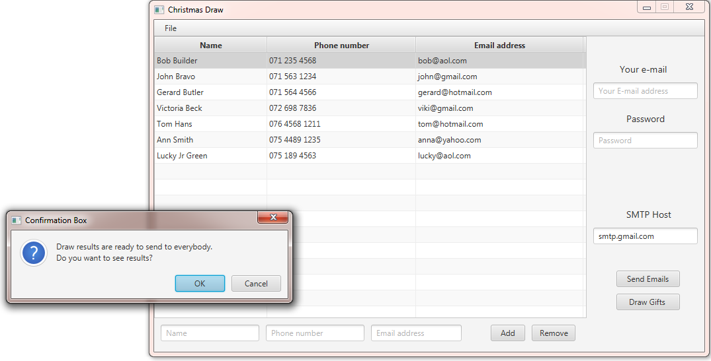

# Christmas-Draw

If there are too many people to buy a Christmas gift for everyone, there is a solution.  Make a draw.  Each person is drawing another person and giving a present to him/her.  This software will perform the process.

Code was written in Intelji 2017. The executable file is in out/artifacts/ChristmasGifts_jar folder.

NOTE!
To be able to use gmail SMTP server to send emails you need to go to gmail's My Account Settings.  In "Sign-in & security" section go to "Apps with account access".  Inside change "Allow less secure apps: ON"

